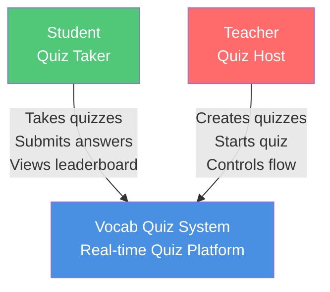
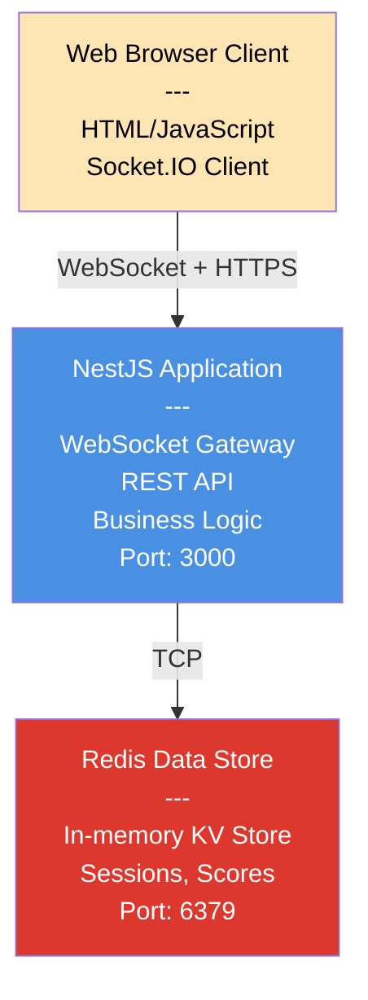
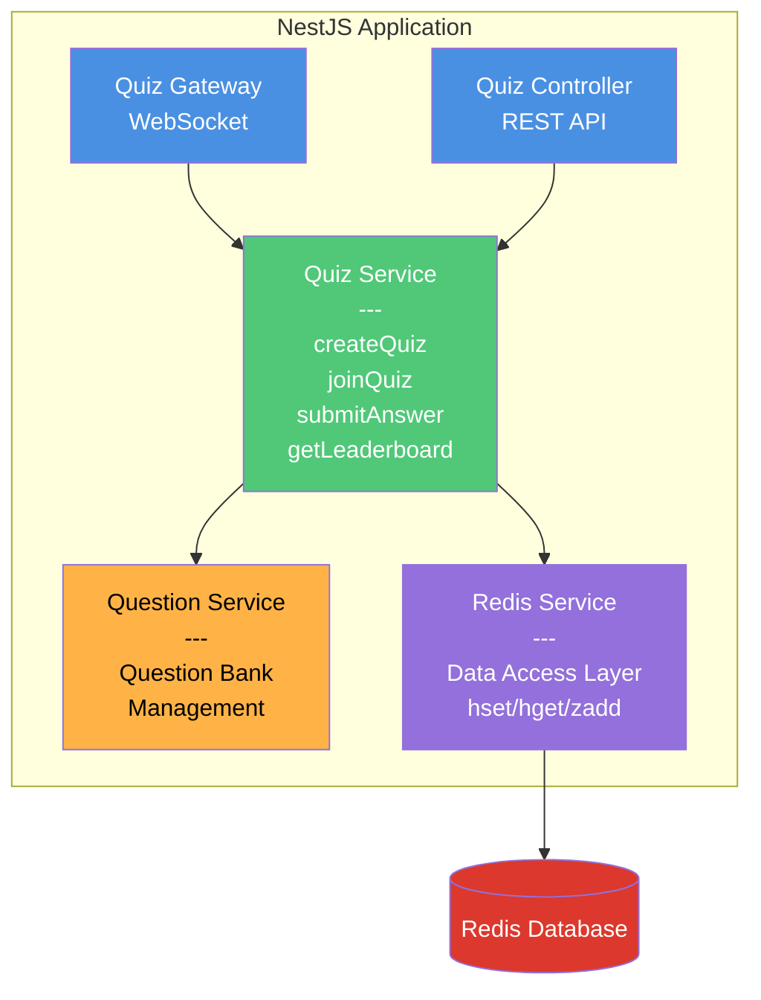

# System Architecture (C4 Model)

## Level 1: System Context

**Who uses the system and what does it do?**



**Purpose:** Enable real-time vocabulary quizzes with instant scoring and live leaderboards

---

## Level 2: Container Diagram

**What are the major technical building blocks?**



**Technology Choices:**

- **Client:** Browser + Socket.IO (real-time bidirectional)
- **Backend:** NestJS + TypeScript (modular, type-safe)
- **Data:** Redis (sub-millisecond latency, perfect data structures)

---

## Level 3: Component Diagram

**What components are inside the NestJS application?**



**Component Responsibilities:**

| Component            | Responsibility                                |
| -------------------- | --------------------------------------------- |
| **Quiz Gateway**     | Handle WebSocket connections & events         |
| **Quiz Controller**  | Handle HTTP REST requests (minimal)           |
| **Quiz Service**     | Core business logic (quiz flow, scoring)      |
| **Question Service** | Manage question bank                          |
| **Redis Service**    | Data access layer (abstract Redis operations) |

---

## Level 4: Key Patterns

### Layered Architecture

```
Presentation  → Gateway + Controller
Business      → Services (Quiz, Question)
Data Access   → Redis Service
Data Storage  → Redis
```

### Event-Driven (WebSocket)

```
Client emits → Gateway receives → Service processes → Gateway broadcasts
```

### Data Model (Redis)

```
Sessions:      quiz:session:{id}        (Hash)
Leaderboard:   quiz:scores:{id}         (Sorted Set)
Participants:  quiz:participants:{id}   (Set)
Answers:       quiz:answers:{id}:{user} (Set)
```

---

## Design Decisions

### Why NestJS?

- ✅ Built-in WebSocket support
- ✅ Dependency injection
- ✅ TypeScript + Decorators
- ✅ Modular architecture

### Why Socket.IO?

- ✅ Automatic reconnection
- ✅ Room-based broadcasting
- ✅ Event acknowledgments
- ✅ Fallback to HTTP polling

### Why Redis?

- ✅ Sub-millisecond latency (< 1ms)
- ✅ Sorted Sets = perfect for leaderboards
- ✅ Atomic operations (ZINCRBY)
- ✅ Built-in TTL for cleanup

### Why Sorted Sets?

- ✅ O(log N) score updates
- ✅ O(log N) rank queries
- ✅ Automatic sorting
- ✅ Atomic updates (no race conditions)

---

## Performance Characteristics

| Operation       | Time Complexity | Latency |
| --------------- | --------------- | ------- |
| Update score    | O(log N)        | < 1ms   |
| Get rank        | O(log N)        | < 1ms   |
| Get top 10      | O(log N + 10)   | < 2ms   |
| Broadcast event | O(N)            | < 10ms  |

**Target:** 100+ concurrent users per quiz

---

## Critical Flows

### Join Quiz

```
Client → join_quiz event
      → Gateway validates
      → Service adds to Redis
      → Broadcast user_joined to room
```

### Submit Answer

```
Client → submit_answer event
      → Service validates answer
      → Calculate score (base + time bonus)
      → Redis ZINCRBY (atomic)
      → Get rank (ZREVRANK)
      → Emit answer_result to sender
      → Broadcast score_update to room
```

### Leaderboard

```
Redis Sorted Set maintains order automatically
Query: ZREVRANGE quiz:scores:{id} 0 9 WITHSCORES
Returns: Top 10 with scores
```

---

## Visual Diagrams

All diagrams are available in the [diagrams/](./diagrams/) folder:

| Diagram                                                       | Type       | Description                      |
| ------------------------------------------------------------- | ---------- | -------------------------------- |
| [System Context](./diagrams/01-system-context.md)             | C4 Level 1 | High-level system view and users |
| [Container Diagram](./diagrams/02-container.md)               | C4 Level 2 | Major technical components       |
| [Component Diagram](./diagrams/03-component.md)               | C4 Level 3 | Internal NestJS components       |
| [Join Quiz Flow](./diagrams/04-sequence-join-quiz.md)         | Sequence   | User join flow step-by-step      |
| [Submit Answer Flow](./diagrams/05-sequence-submit-answer.md) | Sequence   | Answer submission and scoring    |
| [Redis Data Model](./diagrams/06-redis-data-model.md)         | Data Model | Redis data structures            |
| [AWS Deployment](./diagrams/07-deployment-aws.md)             | Deployment | Production AWS architecture      |
| [CI/CD Pipeline](./diagrams/08-cicd-pipeline.md)              | CI/CD      | Deployment automation pipeline   |

**Viewing Options:**

- **GitHub/GitLab**: Diagrams render automatically in markdown files
- **Online Editor**: Copy/paste into [mermaid.live](https://mermaid.live)
- **VS Code**: Install "Markdown Preview Mermaid Support" extension

---

**See [API.md](./API.md) for complete API reference**
