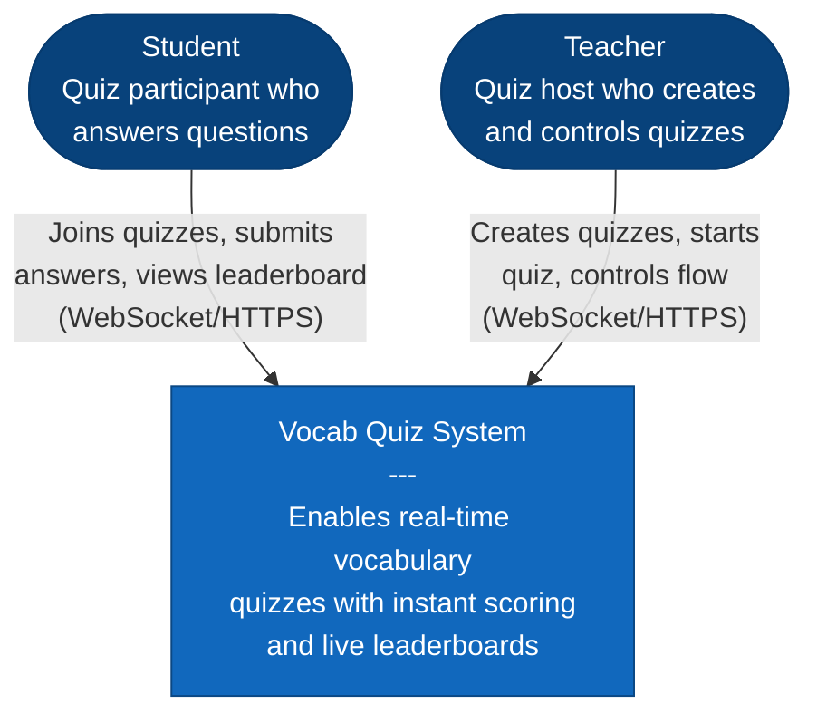

# System Context Diagram (C4 Level 1)

This diagram shows the high-level view of the Real-Time Vocabulary Quiz system and its users.

## Description

**Users:**
- **Students**: Take quizzes, submit answers, and view their ranking
- **Teachers**: Create and manage quiz sessions, control quiz flow

**System:**
- **Vocab Quiz System**: Real-time vocabulary quiz platform with instant scoring and live leaderboards

**Communication:**
- WebSocket for real-time updates
- HTTPS for secure REST API calls
