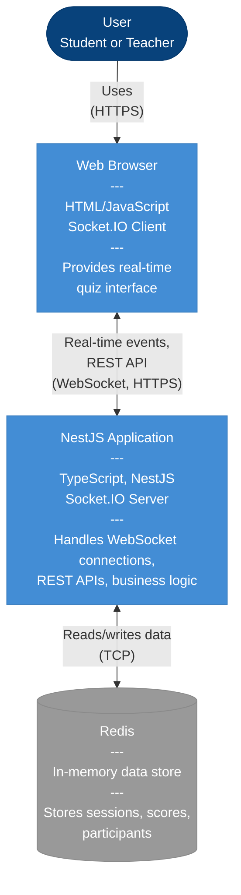

# Container Diagram (C4 Level 2)

This diagram shows the major containers (applications and data stores) that make up the system.

## Container Details

| Container | Technology | Responsibility |
|-----------|-----------|----------------|
| **Web Browser** | HTML/JS + Socket.IO | User interface, real-time event handling |
| **NestJS Application** | TypeScript + NestJS | Business logic, WebSocket server, REST API |
| **Redis** | In-memory database | Session state, leaderboards, participant data |

## Communication Protocols

- **HTTPS**: Secure REST API calls
- **WebSocket**: Real-time bidirectional communication
- **TCP**: Redis protocol communication
