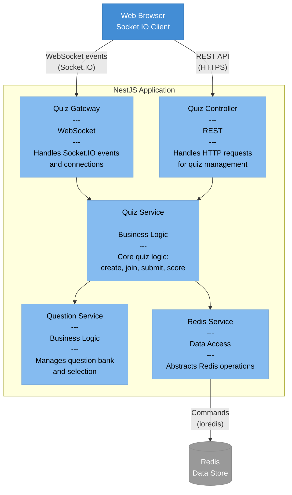

# Component Diagram (C4 Level 3)

This diagram shows the internal components of the NestJS Application.

## Component Responsibilities

| Component | Layer | Responsibility |
|-----------|-------|----------------|
| **Quiz Gateway** | Presentation | Handle WebSocket connections and events (join, submit, etc.) |
| **Quiz Controller** | Presentation | Handle HTTP REST API endpoints |
| **Quiz Service** | Business Logic | Core quiz operations (create, join, submit, scoring) |
| **Question Service** | Business Logic | Question bank management and answer validation |
| **Redis Service** | Data Access | Abstract Redis operations (CRUD, leaderboard queries) |

## Architecture Pattern

**Layered Architecture:**
- **Presentation Layer**: Gateway + Controller
- **Business Logic Layer**: Quiz Service + Question Service
- **Data Access Layer**: Redis Service
- **Data Storage**: Redis
