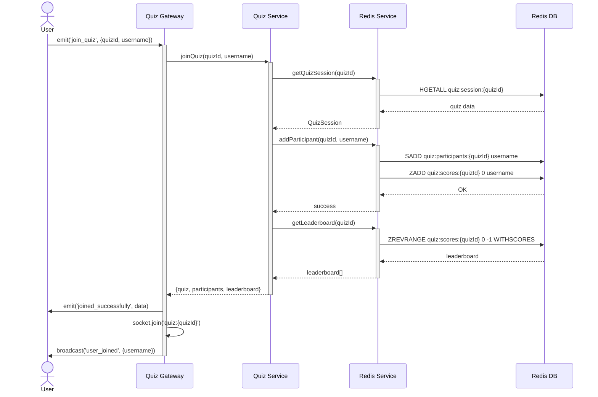

# Sequence Diagram: User Joins Quiz

This diagram shows the complete flow when a user joins a quiz session.

## Flow Steps

1. **User emits join request** - Client sends `join_quiz` event with quiz ID and username
2. **Gateway receives event** - WebSocket gateway handles the connection
3. **Service validates quiz** - Checks if quiz exists and is joinable
4. **Add to participants** - User added to quiz participant set
5. **Initialize score** - User score set to 0 in leaderboard
6. **Get current state** - Fetch current leaderboard
7. **Confirm join** - Send confirmation to user with quiz data
8. **Join room** - Add socket to quiz room for broadcasts
9. **Broadcast** - Notify all participants that a new user joined

## Performance

- **Total latency**: < 10ms
- **Redis operations**: 4 commands (1 HGETALL, 1 SADD, 1 ZADD, 1 ZREVRANGE)
- **Complexity**: O(log N) for sorted set operations
