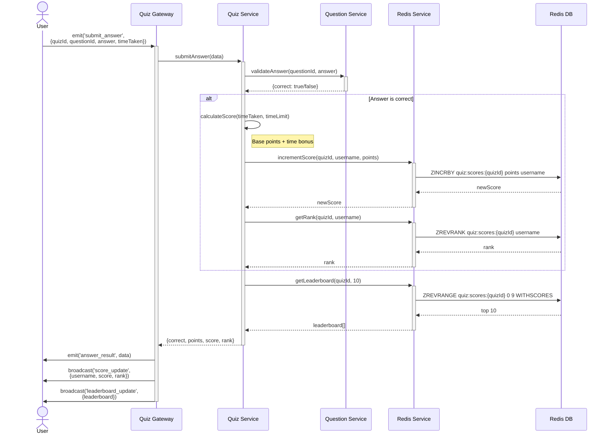

# Sequence Diagram: Submit Answer

This diagram shows the complete flow when a user submits an answer.



## Flow Steps

1. **User submits answer** - Client sends answer with timing data
2. **Gateway receives** - WebSocket handler processes submission
3. **Validate answer** - Check if answer is correct
4. **Calculate score** - Base points + time bonus (if correct)
5. **Update score atomically** - ZINCRBY ensures no race conditions
6. **Get user rank** - ZREVRANK returns position in leaderboard
7. **Fetch top 10** - Get current top 10 for broadcast
8. **Send personal result** - User gets their score and correctness
9. **Broadcast score update** - All participants notified of score change
10. **Broadcast leaderboard** - All participants get updated top 10

## Scoring Formula

```javascript
basePoints = difficulty === 'easy' ? 10 : difficulty === 'medium' ? 20 : 30;
timeBonus = Math.max(0, (timeLimit - timeTaken) * 0.1);
totalPoints = basePoints + timeBonus;
```

## Performance

- **Latency**: < 10ms end-to-end
- **Redis operations**: 3 commands (1 ZINCRBY, 1 ZREVRANK, 1 ZREVRANGE)
- **Atomic**: ZINCRBY prevents race conditions
- **Complexity**: O(log N) for all sorted set operations
