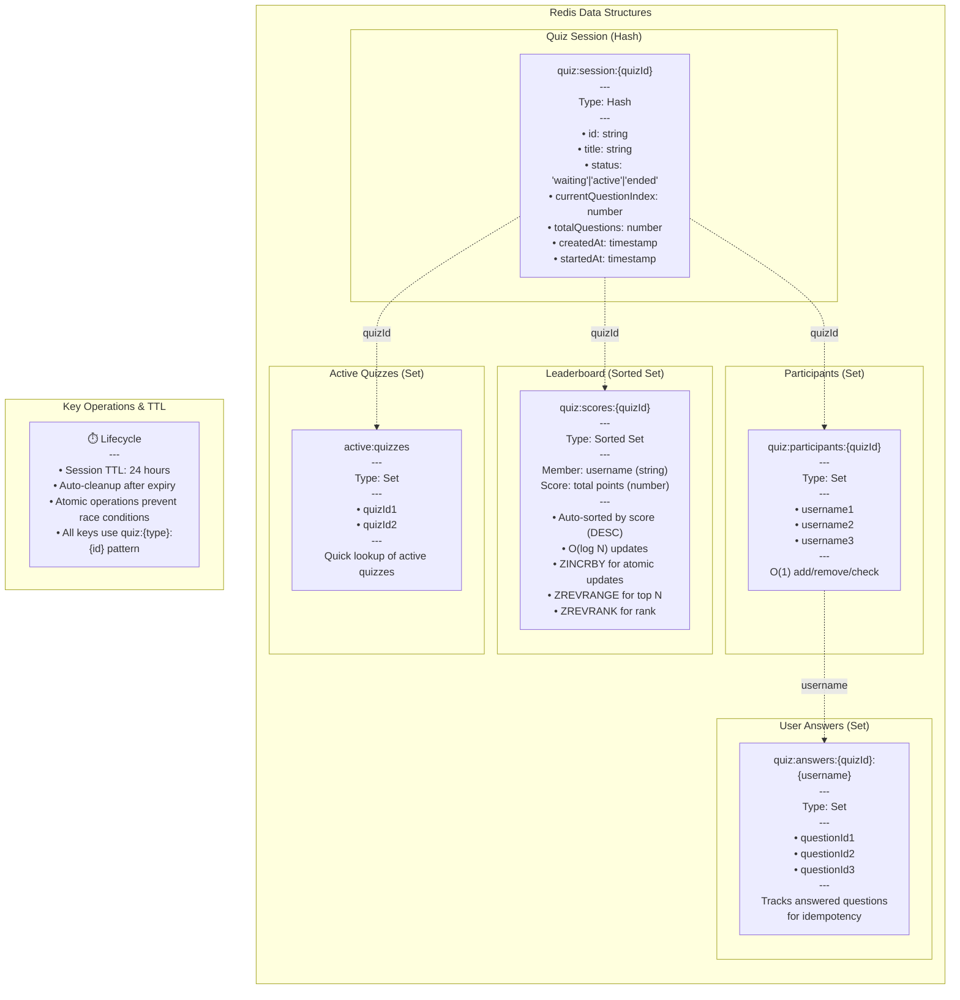

# Redis Data Model

This diagram shows all Redis data structures used in the system.

## Data Structure Details

### 1. Quiz Session (Hash)
**Key Pattern:** `quiz:session:{quizId}`

Stores quiz metadata and current state.

**Fields:**
- `id`: Unique quiz identifier
- `title`: Quiz title
- `status`: Current state (waiting/active/ended)
- `currentQuestionIndex`: Which question is active
- `totalQuestions`: Total number of questions
- `createdAt`: Creation timestamp
- `startedAt`: Start timestamp

### 2. Leaderboard (Sorted Set)
**Key Pattern:** `quiz:scores:{quizId}`

Maintains real-time ranking of all participants.

**Structure:**
- **Member**: Username (string)
- **Score**: Total points (float)

**Operations:**
- `ZINCRBY`: Atomically increment score
- `ZREVRANGE`: Get top N users
- `ZREVRANK`: Get user's rank (0-based)

**Why Sorted Set?**
- O(log N) updates - much faster than array sorting
- Automatic sorting by score
- Atomic operations prevent race conditions
- Perfect for leaderboards

### 3. Participants (Set)
**Key Pattern:** `quiz:participants:{quizId}`

Tracks all users who joined the quiz.

**Operations:**
- `SADD`: Add participant
- `SMEMBERS`: Get all participants
- `SISMEMBER`: Check if user joined

### 4. User Answers (Set)
**Key Pattern:** `quiz:answers:{quizId}:{username}`

Tracks which questions a user has answered (for idempotency).

**Operations:**
- `SADD`: Mark question as answered
- `SISMEMBER`: Check if already answered

### 5. Active Quizzes (Set)
**Key Pattern:** `active:quizzes`

Global set of active quiz IDs for quick lookup.

**Operations:**
- `SADD`: Add active quiz
- `SREM`: Remove ended quiz
- `SMEMBERS`: List all active quizzes

## Performance Characteristics

| Operation | Data Structure | Complexity | Latency |
|-----------|---------------|-----------|---------|
| Update score | Sorted Set (ZINCRBY) | O(log N) | < 1ms |
| Get rank | Sorted Set (ZREVRANK) | O(log N) | < 1ms |
| Get top 10 | Sorted Set (ZREVRANGE) | O(log N + 10) | < 2ms |
| Add participant | Set (SADD) | O(1) | < 1ms |
| Check answered | Set (SISMEMBER) | O(1) | < 1ms |

## TTL & Cleanup

- **Session TTL**: 24 hours
- **Auto-cleanup**: Redis automatically removes expired keys
- **Pattern**: All keys use `quiz:{type}:{id}` for easy identification
- **Atomic operations**: Prevent race conditions in concurrent scenarios
