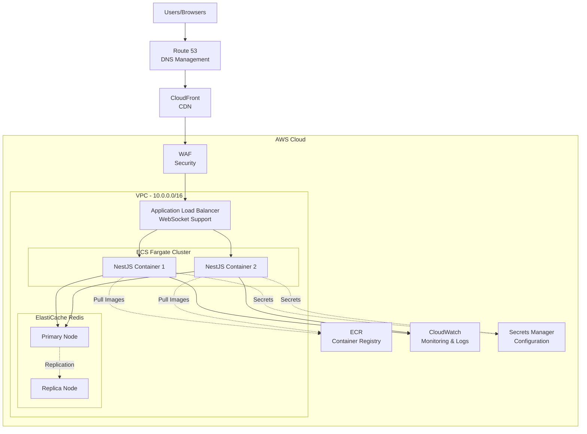

# AWS Deployment Architecture

This diagram shows how the Real-Time Vocabulary Quiz system is deployed on AWS infrastructure.

## Architecture Overview

### High Availability

- **Multi-AZ Deployment**: Resources across 2 Availability Zones
- **Auto Scaling**: 2-10 ECS tasks based on demand
- **Redis Replication**: Primary-Replica for data redundancy
- **Load Balancing**: ALB with health checks and WebSocket support

### Key Components

| Component           | Purpose           | Configuration                                |
| ------------------- | ----------------- | -------------------------------------------- |
| **Route 53**        | DNS Management    | Domain routing to CloudFront/ALB             |
| **CloudFront**      | CDN               | Static asset caching, global distribution    |
| **WAF**             | Security          | Rate limiting, SQL injection, XSS protection |
| **ALB**             | Load Balancer     | WebSocket support, HTTPS termination         |
| **ECS Fargate**     | Container Runtime | 0.5-1 vCPU, 1-2GB RAM per task               |
| **ElastiCache**     | Redis Database    | cache.t3.medium, Multi-AZ                    |
| **ECR**             | Image Registry    | Docker image storage                         |
| **CloudWatch**      | Monitoring        | Logs, metrics, alarms                        |
| **Secrets Manager** | Credentials       | Encrypted secret storage                     |

## AWS Services Detail

### Compute - ECS Fargate

- **Serverless containers** - No EC2 management required
- **Task Configuration**: 512-1024 vCPU, 1-2 GB memory
- **Health Checks**: `/health` endpoint monitoring
- **Auto Scaling**: Based on CPU, memory, request count

### Data - ElastiCache Redis

- **Managed Service**: Automatic failover and patching
- **Multi-AZ**: Primary in AZ1, Replica in AZ2
- **Daily Backups**: 7-day retention
- **Encryption**: In-transit and at-rest

### Networking

- **VPC**: Isolated network (10.0.0.0/16)
- **3-Tier Architecture**: Public, Private, Data subnets
- **Internet Access**: Via NAT Gateways for private subnets

### Security

- **Security Groups**: Least-privilege network access
- **WAF Rules**: Rate limiting (1000 req/5min), injection protection
- **TLS 1.2+**: All external communication encrypted
- **IAM Roles**: Task execution and task roles with minimal permissions

## Security Best Practices

1. **Network Isolation**
   - Private subnets for application and data
   - No direct internet access to containers
   - NAT Gateways for outbound traffic

2. **Encryption**
   - TLS 1.2+ for all connections
   - Redis encryption enabled
   - Secrets Manager with KMS

3. **Access Control**
   - IAM roles with least privilege
   - Security groups restricting ports
   - VPC Flow Logs enabled

4. **Monitoring**
   - CloudWatch Logs for all services
   - CloudTrail for API auditing
   - Alarms for critical metrics

---

**See also:** [CI/CD Pipeline](./08-cicd-pipeline.md) for deployment automation