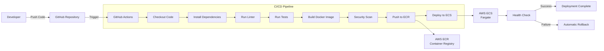

# CI/CD Pipeline

This document describes the continuous integration and deployment pipeline for the Real-Time Vocabulary Quiz application.

## Pipeline Overview

### Trigger Events

- **Push to main branch**: Full CI/CD pipeline
- **Pull Request**: Build and test only (no deployment)
- **Manual trigger**: Deploy specific version

### Pipeline Stages

| Stage        | Purpose                     |
| ------------ | --------------------------- |
| **Checkout** | Get latest code             |
| **Install**  | Install dependencies        |
| **Lint**     | Code quality check          |
| **Test**     | Run all tests               |
| **Build**    | Create Docker image         |
| **Scan**     | Security vulnerability scan |
| **Push**     | Upload to ECR               |
| **Deploy**   | Update ECS service          |
